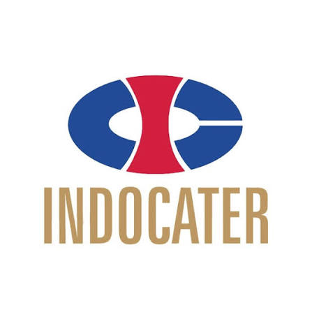

<div align="center">
  
  <h1>Enterprise HRIS Platform</h1>
  <p><strong>A production-quality Human Resource Information System for PT Indocater.</strong></p>
  
  [](https://nextjs.org/)
  [](https://www.typescriptlang.org/)
  [](https://tailwindcss.com/)
  [](https://supabase.com/)
</div>

<br />

A modernized, enterprise-scale frontend built with **Next.js 15 (App Router)**, **TypeScript**, and **Tailwind CSS**. Designed for comprehensive HR operations with full responsiveness, dark-mode support, WCAG AA accessibility, and integrated backend logic powered by **Supabase**.

---

## 🛠 Tech Stack

| Layer | Technology |
|-------|-----------|
| **Framework** | Next.js 15 (App Router) |
| **Language** | TypeScript 5 |
| **Styling** | Tailwind CSS 3 (Custom Enterprise Theme) |
| **Icons** | Lucide React |
| **Tables** | TanStack Table v8 |
| **Charts** | Recharts 3 |
| **Forms** | React Hook Form + Zod |
| **Database & Auth** | Supabase & `@supabase/ssr` |
| **Analytics** | Vercel Analytics |
| **Package Manager**| `npm` / `pnpm` |

---

## 🚀 Key Modules

| Module | Route | Description |
|--------|-------|-------------|
| **Dashboard** | `/` | Role-aware command center with KPIs, charts, and activity widgets. |
| **People** | `/people` | Employee directory, profiles (Employee 360), org structure, documents. |
| **Workforce** | `/workforce` | Attendance tracking, leave management, overtime, shift planning. |
| **Talent** | `/talent` | Hiring pipeline, onboarding, competency, certification. Includes **Training Module** (Planning & Realization), **PDF Certificate generation (jsPDF)**, and **Certificate Upload (Supabase Storage)**. |
| **Compensation** | `/compensation` | Benefits, insurance, medical, claims, welfare, payroll readiness. |
| **Analytics** | `/analytics` | BI dashboards for workforce, attendance, leave, recruitment, training, compliance. |
| **Administration** | `/administration` | Master data, user management, roles & permissions, audit logs. |
| **Identity** | `/identity` | IAM, SSO/MFA config, session management, security policies. |
| **Login** | `/login` | Authentication using Supabase Auth (with built-in Demo Bypass). |

---

## 💻 Getting Started

### 1. Prerequisites
- **Node.js** 18+
- **npm** or **pnpm**

### 2. Installation
Clone the repository and install dependencies:
```bash
npm install
```

### 3. Environment Variables
Create a `.env.local` file in the root directory based on `.env.example` and add your Supabase credentials:
```env
NEXT_PUBLIC_SUPABASE_URL=your_supabase_project_url
NEXT_PUBLIC_SUPABASE_ANON_KEY=your_supabase_anon_key
NEXT_PUBLIC_SUPABASE_PUBLISHABLE_KEY=your_supabase_publishable_key
```

### 4. Development Server
Run the local development server:
```bash
npm run dev
```
Open [http://localhost:3000](http://localhost:3000) to view the application.

> **Demo Login:** You can bypass the standard authentication in development using the demo credentials:
> - **Username:** `demo@indocater.co.id`
> - **Password:** `demo123`

### 5. Build for Production
```bash
npm run build
npm start
```

---

## 🎨 Design System

All UI is built on a consistent, premium dark-mode design language tailored for PT Indocater:

- **Color Palette**: `bg-background` (Navy `#081C3A`), Corporate Blue `primary`, Indocater Gold `indogold`.
- **Border Radius**: `rounded-[28px]` cards, `rounded-3xl` inputs, `rounded-full` pills.
- **Typography**: Inter font, uppercase tracking labels, `tabular-nums` for metrics.
- **Shadows & Glassmorphism**: `surface-panel` (backdrop blur), `shadow-card` (soft elevated look).
- **Accessibility**: Focus rings (`focus:ring-2 focus:ring-primary`) implemented throughout for keyboard navigation.

---

## 🔗 Backend & Supabase Integration

This platform seamlessly integrates with **Supabase** for backend operations:
- **Authentication**: Managed via `@supabase/ssr` for secure cookie-based session management across the Next.js App Router.
- **Database**: Connected to Supabase PostgreSQL for modules like Training Participants and Certificates.
- **Storage**: Integration with Supabase Storage buckets for uploading and retrieving PDF Certificates.
- **Graceful Fallbacks**: Local state fallbacks (`localNewParticipants`) ensure the UI remains fully functional and unblocked even if the Supabase connection drops or during local offline testing.

---

## ♿ Accessibility (a11y)
- **WCAG AA** targeted components.
- Screen-reader friendly with `aria-label`, `aria-labelledby`, and `sr-only` attributes.
- Accessible modals (Dialogs) with focus trapping.
- Contrast ratios optimized for dark mode readability.

---

## 📈 Enterprise Readiness Score

| Dimension | Rating |
|-----------|--------|
| **Architecture** | ⭐⭐⭐⭐⭐ Modular, composable, server-first (App Router) |
| **Design Consistency**| ⭐⭐⭐⭐⭐ Unified custom design tokens, shared UI components |
| **Responsiveness** | ⭐⭐⭐⭐⭐ Mobile-first, fluid across all breakpoints |
| **Backend Integration**| ⭐⭐⭐⭐⭐ Supabase DB, Auth, and Storage integrated |
| **Performance** | ⭐⭐⭐⭐ Server components, debounce hooks, static generation |
| **Code Quality** | ⭐⭐⭐⭐⭐ TypeScript strict, ESLint configured, solid folder structure |
